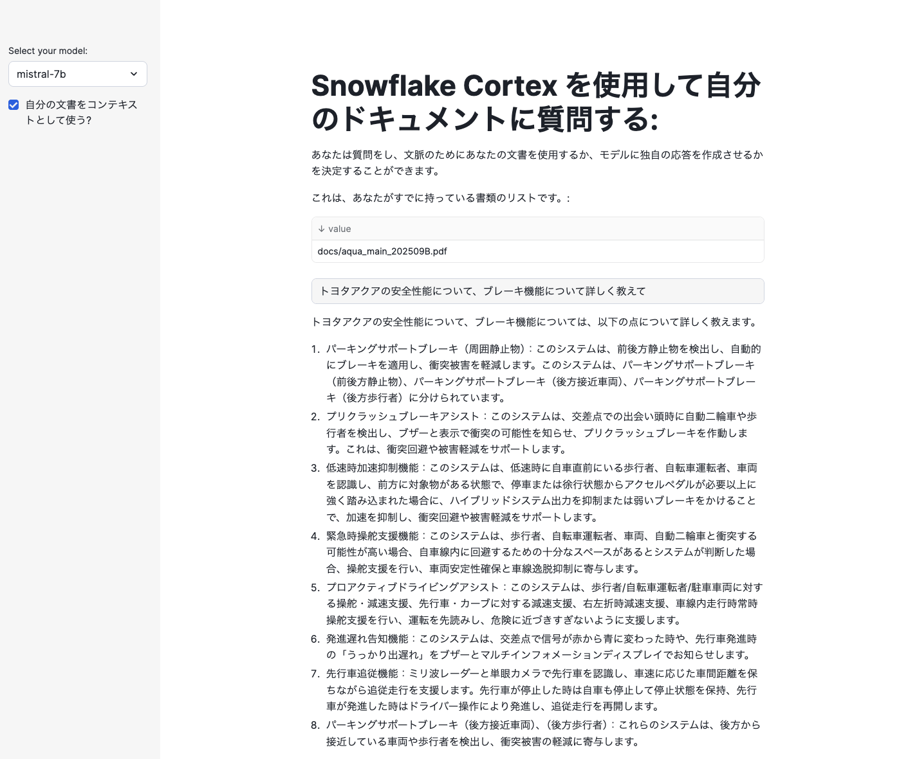
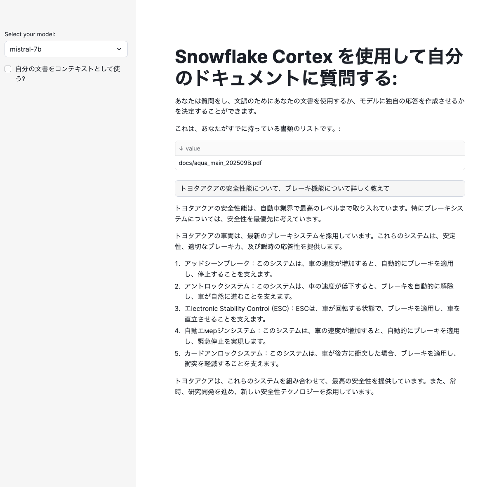
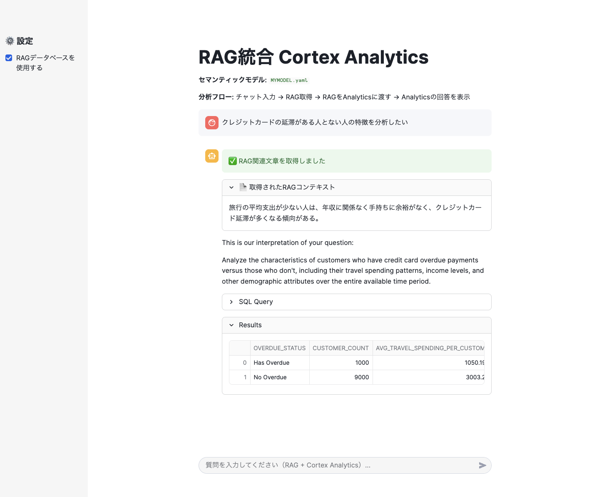

# 純粋なRAG

## 1. RAG構築
参考）https://zenn.dev/minedia/articles/21d5b4b23e38eb#%E3%83%81%E3%83%A3%E3%83%83%E3%83%88ui%E3%81%A8%E3%83%81%E3%83%A3%E3%83%83%E3%83%88%E3%81%AE%E3%83%AD%E3%82%B8%E3%83%83%E3%82%AF%E3%81%AE%E6%A7%8B%E7%AF%89

```
-- データベース作成（名称変えれば良かった。。。）
CREATE DATABASE DIGITAL_AGENCY_CORTEX_DOCS;

-- スキーマ作成
CREATE SCHEMA DATA;

-- PDFファイルをLangchainで読み取りチャンクテーブルにする
create or replace function pdf_text_chunker(file_url string)
returns table (chunk varchar)
language python
runtime_version = '3.9'
handler = 'pdf_text_chunker'
packages = ('snowflake-snowpark-python','PyPDF2', 'langchain')
as
$$
from snowflake.snowpark.types import StringType, StructField, StructType
from langchain.text_splitter import RecursiveCharacterTextSplitter
from snowflake.snowpark.files import SnowflakeFile
import PyPDF2, io
import logging
import pandas as pd

class pdf_text_chunker:

    def read_pdf(self, file_url: str) -> str:
    
        logger = logging.getLogger("udf_logger")
        logger.info(f"Opening file {file_url}")
    
        with SnowflakeFile.open(file_url, 'rb') as f:
            buffer = io.BytesIO(f.readall())
            
        reader = PyPDF2.PdfReader(buffer)   
        text = ""
        for page in reader.pages:
            try:
                text += page.extract_text().replace('\n', ' ').replace('\0', ' ')
            except:
                text = "Unable to Extract"
                logger.warn(f"Unable to extract from file {file_url}, page {page}")
        
        return text

    def process(self,file_url: str):

        text = self.read_pdf(file_url)
        
        text_splitter = RecursiveCharacterTextSplitter(
            chunk_size = 4000, #Adjust this as you see fit
            chunk_overlap  = 400, #This let's text have some form of overlap. Useful for keeping chunks contextual
            length_function = len
        )
    
        chunks = text_splitter.split_text(text)
        df = pd.DataFrame(chunks, columns=['chunks'])
        
        yield from df.itertuples(index=False, name=None)
$$;

-- PDFファイルをアップロードするステージを作成する
create or replace stage docs ENCRYPTION = (TYPE = 'SNOWFLAKE_SSE') DIRECTORY = ( ENABLE = true );

-- チャンクテーブル
create or replace TABLE DOCS_CHUNKS_TABLE ( 
    RELATIVE_PATH VARCHAR(16777216), -- PDFファイルへの相対パス
    SIZE NUMBER(38,0), -- PDFファイルのサイズ
    FILE_URL VARCHAR(16777216), -- PDFのURL
    SCOPED_FILE_URL VARCHAR(16777216), -- スコープ付きURL
    CHUNK VARCHAR(16777216), -- テキストの一部
    CHUNK_VEC VECTOR(FLOAT, 768) );  -- VECTORデータタイプの埋め込み

-- チャクテーブルへの登録、SELECT句内でembed
insert into docs_chunks_table (relative_path, size, file_url,
                            scoped_file_url, chunk, chunk_vec)
    select relative_path, 
            size,
            file_url, 
            build_scoped_file_url(@docs, relative_path) as scoped_file_url,
            func.chunk as chunk,
            SNOWFLAKE.CORTEX.EMBED_TEXT_768('e5-base-v2',chunk) as chunk_vec
    from 
        directory(@docs),
        TABLE(pdf_text_chunker(build_scoped_file_url(@docs, relative_path))) as func;

        
-- 確認用
select relative_path, size, chunk, chunk_vec from docs_chunks_table limit 5;

select relative_path, count(*) as num_chunks 
    from docs_chunks_table
    group by relative_path;

```

## 2. アプリ構築
streamlitで下記を実装
```
import streamlit as st # Import python packages
from snowflake.snowpark.context import get_active_session
session = get_active_session() # Get the current credentials

import pandas as pd

pd.set_option("max_colwidth",None)
num_chunks = 3 # Num-chunks provided as context. Play with this to check how it affects your accuracy

def create_prompt (myquestion, rag):

    if rag == 1:    

        cmd = """
         with results as
         (SELECT RELATIVE_PATH,
           VECTOR_COSINE_SIMILARITY(docs_chunks_table.chunk_vec,
                    SNOWFLAKE.CORTEX.EMBED_TEXT_768('e5-base-v2', ?)) as similarity,
           chunk
         from docs_chunks_table
         order by similarity desc
         limit ?)
         select chunk, relative_path from results 
         """
    
        df_context = session.sql(cmd, params=[myquestion, num_chunks]).to_pandas()      
        
        context_lenght = len(df_context) -1

        prompt_context = ""
        for i in range (0, context_lenght):
            prompt_context += df_context._get_value(i, 'CHUNK')

        prompt_context = prompt_context.replace("'", "")
        relative_path =  df_context._get_value(0,'RELATIVE_PATH')
    
        prompt = f"""
          'あなたは、日本語を話す提供された文脈から情報を引き出す専門家です。文脈に基づいて質問に答えてください。
          簡潔に、そして想像を膨らませないでください。情報がない場合には、その旨を明記してください。
          コンテキスト: {prompt_context}
          質問:  
           {myquestion} 
           回答: '
           """
        cmd2 = f"select GET_PRESIGNED_URL(@docs, '{relative_path}', 360) as URL_LINK from directory(@docs)"
        df_url_link = session.sql(cmd2).to_pandas()
        url_link = df_url_link._get_value(0,'URL_LINK')

    else:
        prompt = f"""あなたは、日本語を話す。
         'Question:  
           {myquestion} 
           Answer: '
           """
        url_link = "None"
        relative_path = "None"
        
    return prompt, url_link, relative_path

def complete(myquestion, model_name, rag = 1):

    prompt, url_link, relative_path =create_prompt (myquestion, rag)
    cmd = f"""
             select SNOWFLAKE.CORTEX.COMPLETE(?,?) as response
           """
    
    df_response = session.sql(cmd, params=[model_name, prompt]).collect()
    return df_response, url_link, relative_path

def display_response (question, model, rag=0):
    response, url_link, relative_path = complete(question, model, rag)
    res_text = response[0].RESPONSE
    st.markdown(res_text)
    if rag == 1:
        display_url = f"Link to [{relative_path}]({url_link}) that may be useful"
        st.markdown(display_url)

#Main code

st.title("Snowflake Cortex を使用して自分のドキュメントに質問する:")
st.write("あなたは質問をし、文脈のためにあなたの文書を使用するか、モデルに独自の応答を作成させるかを決定することができます。")
st.write("これは、あなたがすでに持っている書類のリストです。:")
docs_available = session.sql("ls @docs").collect()
list_docs = []
for doc in docs_available:
    list_docs.append(doc["name"])
st.dataframe(list_docs)

#Here you can choose what LLM to use. Please note that they will have different cost & performance
model = st.sidebar.selectbox('Select your model:',(
                                     'mistral-7b'))

question = st.text_input("Enter question", placeholder="生成AIを利用する上でのリスクは？", label_visibility="collapsed")

rag = st.sidebar.checkbox('自分の文書をコンテキストとして使う?')

print (rag)

if rag:
    use_rag = 1
else:
    use_rag = 0

if question:
    display_response (question, model, use_rag)
```

## 3. RAGとして機能するのか試運転

ドキュメントはアクアの最新PDFをこちらから取得して登録
https://toyota.jp/request/webcatalog/

RAGありの場合、ブレーキ機能についてPDFに書いてある詳細な内容を答えてくれていそう。


RAGなしの場合、雑な内容。RAGとして機能していそう。


## 4. Cortex分析と統合してみる
- チャットして
- RAGして
- Cortex分析に指示とRAGを一緒に渡して分析してもらう
的なことがしたい。
```
import _snowflake
import json
import streamlit as st
import time
from snowflake.snowpark.context import get_active_session

# Cortex Analytics設定
DATABASE = "TESTDB"
SCHEMA   = "PUBLIC"
STAGE    = "MY_INT_STAGE"
FILE     = "MYMODEL.yaml"  # セマンティックビューのYAMLファイル名

# RAG設定
num_chunks = 3  # 取得するチャンク数

def get_rag_context(question):
    """RAGから関連文章を取得する関数"""
    try:
        # RAGから関連文章を取得
        cmd = """
         with results as
         (SELECT RELATIVE_PATH,
           VECTOR_COSINE_SIMILARITY(docs_chunks_table.chunk_vec,
                    SNOWFLAKE.CORTEX.EMBED_TEXT_768('e5-base-v2', ?)) as similarity,
           chunk
         from DIGITAL_AGENCY_CORTEX_DOCS.DATA.DOCS_CHUNKS_TABLE
         order by similarity desc
         limit ?)
         select chunk, relative_path, similarity from results 
         """
        
        session = get_active_session()
        df_context = session.sql(cmd, params=[question, num_chunks]).to_pandas()
        
        if len(df_context) == 0:
            return None, None, None
            
        # 関連文章を結合
        context_text = ""
        for i in range(len(df_context)):
            context_text += df_context._get_value(i, 'CHUNK') + "\n\n"

        relative_path = df_context._get_value(0, 'RELATIVE_PATH')
        
        # ドキュメントのURLを取得
        cmd2 = f"select GET_PRESIGNED_URL(@docs, '{relative_path}', 360) as URL_LINK from directory(@docs)"
        df_url_link = session.sql(cmd2).to_pandas()
        url_link = df_url_link._get_value(0, 'URL_LINK')
        
        return context_text, url_link, relative_path
        
    except Exception as e:
        st.error(f"RAGから関連文章の取得中にエラーが発生しました: {str(e)}")
        return None, None, None

def send_message(prompt: str, rag_context: str = None) -> dict:
    """Calls the REST API and returns the response."""
    # RAGコンテキストを含むプロンプトを作成
    if rag_context:
        enhanced_prompt = f"""
        以下のRAGコンテキストを参考に、質問に答えてください。
        
        RAGコンテキスト:
        {rag_context}
        
        質問: {prompt}
        
        上記のRAGコンテキストを基に、詳細で有用な回答を提供してください。
        """
    else:
        enhanced_prompt = prompt
    
    request_body = {
        "messages": [
            {
                "role": "user",
                "content": [
                    {
                        "type": "text",
                        "text": enhanced_prompt
                    }
                ]
            }
        ],
        "semantic_model_file": f"@{DATABASE}.{SCHEMA}.{STAGE}/{FILE}",
    }
    resp = _snowflake.send_snow_api_request(
        "POST",
        f"/api/v2/cortex/analyst/message",
        {},
        {},
        request_body,
        {},
        30000,
    )
    if resp["status"] < 400:
        return json.loads(resp["content"])
    else:
        raise Exception(
            f"Failed request with status {resp['status']}: {resp}"
        )

def process_message(prompt: str, use_rag: bool = True) -> None:
    """Processes a message and adds the response to the chat."""
    st.session_state.messages.append(
        {"role": "user", "content": [{"type": "text", "text": prompt}]}
    )
    with st.chat_message("user"):
        st.markdown(prompt)
    
    with st.chat_message("assistant"):
        # RAGから関連文章を取得
        rag_context = None
        if use_rag:
            with st.spinner("RAGから関連文章を取得中..."):
                rag_context, url_link, relative_path = get_rag_context(prompt)
                if rag_context:
                    st.success("✅ RAG関連文章を取得しました")
                    # RAGコンテキストを表示
                    with st.expander("📄 取得されたRAGコンテキスト", expanded=False):
                        st.text(rag_context)
                else:
                    st.warning("⚠️ RAG関連文章が見つかりませんでした")
        
        # Cortex Analyticsで分析
        with st.spinner("Cortex Analyticsで分析中..."):
            response = send_message(prompt=prompt, rag_context=rag_context)
            content = response["message"]["content"]
            display_content(content=content)
    st.session_state.messages.append({"role": "assistant", "content": content})

def display_content(content: list, message_index: int = None) -> None:
    """Displays a content item for a message."""
    message_index = message_index or len(st.session_state.messages)
    for item in content:
        if item["type"] == "text":
            st.markdown(item["text"])
        elif item["type"] == "suggestions":
            with st.expander("Suggestions", expanded=True):
                for suggestion_index, suggestion in enumerate(item["suggestions"]):
                    if st.button(suggestion, key=f"{message_index}_{suggestion_index}"):
                        st.session_state.active_suggestion = suggestion
        elif item["type"] == "sql":
            with st.expander("SQL Query", expanded=False):
                st.code(item["statement"], language="sql")
            with st.expander("Results", expanded=True):
                with st.spinner("Running SQL..."):
                    session = get_active_session()
                    df = session.sql(item["statement"]).to_pandas()
                    # SQL結果をDataのみで表示
                    st.dataframe(df)
            

st.title("RAG統合 Cortex Analytics")
st.markdown(f"**セマンティックモデル:** `{FILE}`")
st.write("**分析フロー:** チャット入力 → RAG取得 → RAGをAnalyticsに渡す → Analyticsの回答を表示")


# サイドバー設定
st.sidebar.header("⚙️ 設定")
use_rag = st.sidebar.checkbox('RAGデータベースを使用する', value=True)

if "messages" not in st.session_state:
    st.session_state.messages = []
    st.session_state.suggestions = []
    st.session_state.active_suggestion = None

for message_index, message in enumerate(st.session_state.messages):
    with st.chat_message(message["role"]):
        display_content(content=message["content"], message_index=message_index)

if user_input := st.chat_input("質問を入力してください（RAG + Cortex Analytics）..."):
    process_message(prompt=user_input, use_rag=use_rag)

if st.session_state.active_suggestion:
    process_message(prompt=st.session_state.active_suggestion, use_rag=use_rag)
    st.session_state.active_suggestion = None
```
こんな感じ
